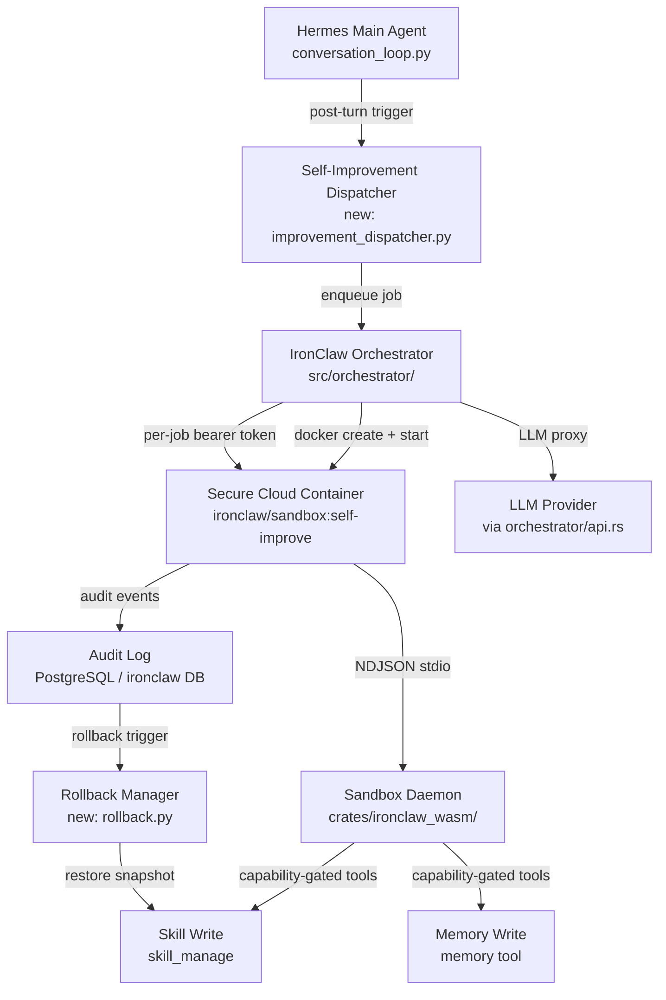
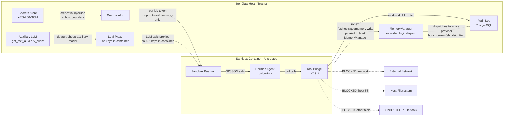
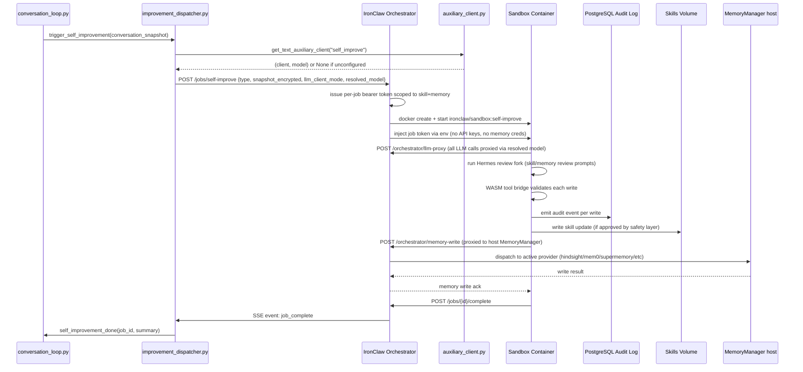
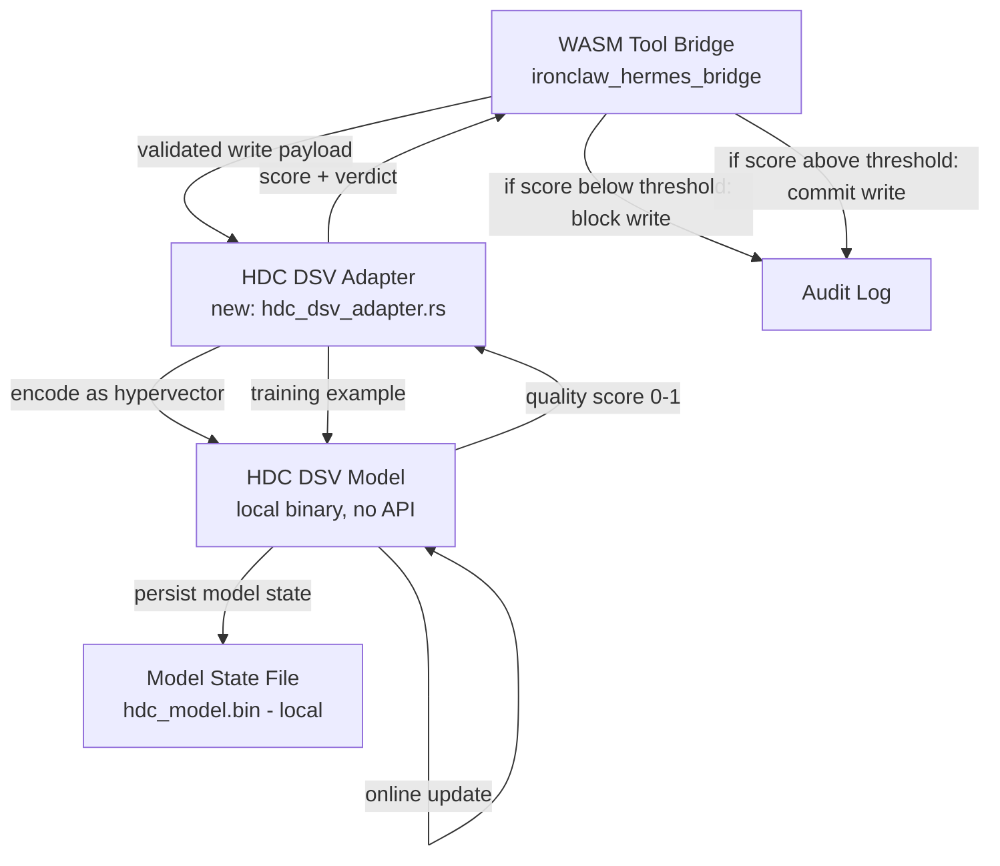
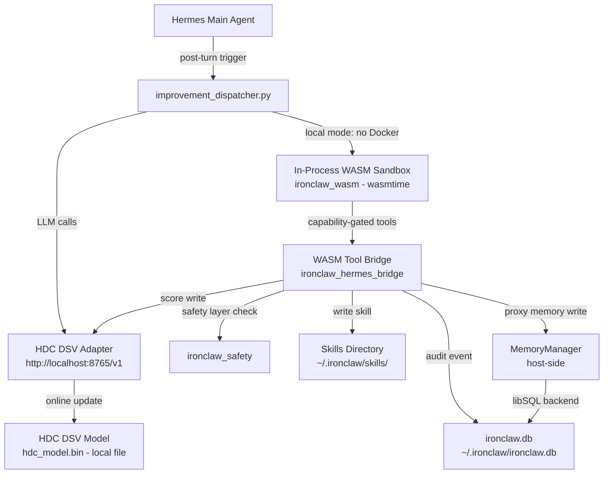

# Hermes + IronClaw: Secure Self-Learning & Self-Improvement in a Cloud Sandbox

**Status:** Draft  
**Created:** 2026-05-18  
**Scope:** Integrate IronClaw's WASM sandbox, Docker execution sandbox, and security layers with Hermes Agent's background review / curator self-improvement loop, running all self-modification work inside a secure, auditable cloud container.

---

## 1. Problem Statement

Hermes Agent already has a working self-improvement loop:
- [`agent/background_review.py`](hermes-agent/agent/background_review.py) — post-turn skill/memory review fork
- [`agent/curator.py`](hermes-agent/agent/curator.py) — periodic background skill maintenance
- [`mini_swe_runner.py`](hermes-agent/mini_swe_runner.py) — SWE trajectory runner (local/Docker/Modal)

IronClaw already has hardened security primitives:
- [`crates/ironclaw_safety/`](ironclaw/crates/ironclaw_safety/) — prompt injection, validation, leak detection, policy
- [`crates/ironclaw_wasm/`](ironclaw/crates/ironclaw_wasm/) — WASM sandbox (wasmtime, fuel metering, allowlisting)
- [`src/sandbox/`](ironclaw/src/sandbox/) — Docker execution sandbox with `SandboxPolicy` enum
- [`src/orchestrator/`](ironclaw/src/orchestrator/) — per-job bearer tokens, container lifecycle
- [`crates/Dockerfile.sandbox`](ironclaw/crates/Dockerfile.sandbox) — hardened sandbox container image

**The gap:** Hermes self-improvement runs in the same process/environment as the main agent. A compromised or runaway self-improvement step can corrupt skills, leak credentials, or exfiltrate data. There is no isolation boundary between "the agent thinking" and "the agent rewriting itself."

**The goal:** Route all Hermes self-improvement work (background review, curator, SWE runner) through IronClaw's sandbox stack, executing inside a secure cloud container with:
- Capability-gated tool access (only `skill_manage` + `memory` writes allowed)
- Network allowlisting (no exfiltration)
- Credential injection at the host boundary (never exposed inside the container)
- Full audit trail of every self-modification
- Rollback on failure or policy violation

---

## 2. Architecture Overview



---

## 3. Component Breakdown

### 3.1 Self-Improvement Dispatcher (`hermes-agent/agent/improvement_dispatcher.py`) — NEW

Replaces the direct `spawn_background_review_thread()` call in [`conversation_loop.py`](hermes-agent/agent/conversation_loop.py). Instead of forking a local `AIAgent`, it:

1. Serializes the conversation snapshot to a signed payload
2. Submits a job to the IronClaw Orchestrator via its internal HTTP API
3. Returns immediately (non-blocking); the orchestrator manages the container lifecycle
4. Polls or subscribes to job completion events via SSE

**Key design decisions:**
- The dispatcher holds no credentials itself — it passes a scoped job token from the orchestrator
- The conversation snapshot is encrypted at rest using IronClaw's AES-256-GCM secrets layer ([`src/secrets/`](ironclaw/src/secrets/))
- Job type is tagged: `MEMORY_REVIEW`, `SKILL_REVIEW`, `CURATOR_RUN`, `SWE_TASK`

### 3.2 IronClaw Orchestrator Extensions (`ironclaw/src/orchestrator/`) — EXTEND

Add a new job type: `SelfImprovementJob`. Extends the existing [`job_manager.rs`](ironclaw/src/orchestrator/job_manager.rs):

```
SelfImprovementJob {
    job_id: Uuid,
    job_type: SelfImprovementJobType,   // MemoryReview | SkillReview | CuratorRun | SweTask
    conversation_snapshot: EncryptedBlob,
    allowed_tools: Vec<ToolName>,        // ["skill_manage", "memory"] only
    network_policy: NetworkPolicy,       // Deny all outbound except LLM proxy
    max_turns: u32,                      // hard cap
    max_wall_seconds: u64,               // hard timeout
    credential_grants: Vec<ScopedGrant>, // only what the job needs
    llm_client_mode: LlmClientMode,      // Auxiliary (default) | Main (opt-in)
}
```

The orchestrator:
- Issues a per-job bearer token scoped to `[skill_manage, memory]` only
- Starts the sandbox container with `SandboxPolicy::WorkspaceWrite` (no host filesystem access)
- Injects credentials at the host boundary via [`src/tools/wasm/credential_injector.rs`](ironclaw/src/tools/wasm/credential_injector.rs)
- Proxies all LLM calls through [`src/orchestrator/api.rs`](ironclaw/src/orchestrator/api.rs) (the container never holds API keys)
- When `llm_client_mode = Auxiliary`: routes LLM proxy calls to the auxiliary provider/model resolved by [`agent/auxiliary_client.py`](hermes-agent/agent/auxiliary_client.py) at dispatch time
- When `llm_client_mode = Main`: routes LLM proxy calls to the same provider/model as the parent agent turn (higher quality, higher cost)

### 3.3 Secure Self-Improvement Container Image — NEW

New `Dockerfile.self-improve` based on [`crates/Dockerfile.sandbox`](ironclaw/crates/Dockerfile.sandbox):

- Builds `sandbox_daemon` binary (already exists)
- Adds Python 3.12 + Hermes Agent wheel (read-only, no pip install at runtime)
- Mounts Hermes skills directory as a **writable** volume (the only writable surface)
- Mounts Hermes memory store as a **writable** volume
- Everything else is read-only (`--read-only` Docker flag)
- No network interface except the loopback + the orchestrator's internal bridge
- Runs as non-root UID 65534 (nobody)
- `seccomp` profile: deny `ptrace`, `mount`, `clone` with `CLONE_NEWUSER`
- `AppArmor` profile: deny writes outside `/hermes-skills/` and `/hermes-memory/`

### 3.4 WASM Tool Bridge for Hermes Skill/Memory Writes — NEW

New WASM tool module: `ironclaw_hermes_bridge.wasm`

Implements the IronClaw `Tool` trait ([`src/tools/tool.rs`](ironclaw/src/tools/tool.rs)) and exposes two tools to the sandboxed agent:

| Tool | Allowed Operations | Denied Operations |
|------|--------------------|-------------------|
| `skill_manage` | `create`, `update`, `write_file` on agent-created skills only | Delete, pin/unpin, modify user-created skills |
| `memory` | `save`, `update` | `delete`, `list_all`, `export` |

The bridge enforces:
- **Ownership check**: only skills tagged `agent_created=true` can be modified
- **Content policy**: runs [`ironclaw_safety::SafetyLayer`](ironclaw/crates/ironclaw_safety/) on every write payload before committing
- **Size limits**: max 64 KB per skill file, max 256 KB total per job
- **Rate limiting**: max 10 skill writes per job, max 5 memory writes per job

**Memory backend note:** Hermes memory is a plugin system with 8+ provider backends (hindsight, mem0, supermemory, honcho, openviking, holographic, retaindb, byterover). Each provider has its own storage mechanism — local embedded daemon, cloud API, SQLite, vector DB, etc. The sandbox container **cannot** mount a generic "memory volume" because there is no single file or socket to mount. Instead, the `memory` tool in the WASM bridge proxies all writes back to the orchestrator host via a narrow RPC call (`POST /orchestrator/memory-write`), which then dispatches to the host-side [`MemoryManager`](hermes-agent/agent/memory_manager.py) that already has the correct provider wired up. This means:
- The container never directly touches the memory backend
- The host-side memory manager enforces the provider's own write semantics
- The WASM bridge only validates the payload (content policy, size limits) before forwarding
- The orchestrator's memory-write endpoint is the only additional surface that needs to be secured

### 3.5 Audit Log & Rollback (`hermes-agent/agent/improvement_audit.py` + `rollback.py`) — NEW

Every self-modification is recorded as an immutable audit event:

```python
@dataclass
class SelfImprovementEvent:
    event_id: str           # UUID
    job_id: str             # links to orchestrator job
    job_type: str           # MEMORY_REVIEW | SKILL_REVIEW | CURATOR_RUN
    timestamp: datetime
    action: str             # skill_create | skill_update | memory_save
    target: str             # skill name or memory key
    before_hash: str        # SHA-256 of content before
    after_hash: str         # SHA-256 of content after
    safety_verdict: str     # PASS | FLAGGED | BLOCKED
    llm_model: str          # which model produced this
    container_id: str       # Docker container that ran it
```

Stored in IronClaw's PostgreSQL database (never deleted — per IronClaw's "LLM data is never deleted" invariant).

**Rollback trigger conditions:**
- Safety layer flags content as policy violation → automatic rollback + job abort
- Job exceeds `max_wall_seconds` → container killed, partial writes rolled back
- Container exits non-zero → all writes from that job rolled back atomically
- Manual: `hermes self-improve rollback --job-id <id>` CLI command

### 3.5b LLM Client Selection for Self-Improvement — NEW DESIGN DECISION

The self-improvement review fork currently uses the **main agent's model** (see [`background_review.py`](hermes-agent/agent/background_review.py:381) — `model=agent.model`). This is expensive for a background task that only needs to write skill updates and memory notes.

**New behavior:**

| Mode | LLM Used | When |
|------|----------|------|
| `auxiliary` (default) | Resolved by [`get_text_auxiliary_client("self_improve")`](hermes-agent/agent/auxiliary_client.py) — typically a cheap fast model (e.g. `google/gemini-3-flash-preview` via OpenRouter) | Always, unless overridden |
| `main` (opt-in) | Same provider/model as the parent agent turn | Only when `SELF_IMPROVE_LLM_CLIENT=main` is set |

**Rationale for defaulting to auxiliary:**
- Self-improvement review tasks (skill updates, memory notes) are well within the capability of smaller models
- Users who haven't explicitly configured a self-improvement LLM should not accidentally burn expensive tokens on background tasks
- The auxiliary client is already the standard pattern for background/secondary tasks in Hermes (compression, web extraction, goal judging, kanban decomposition, etc.)
- If no auxiliary provider is configured, the dispatcher logs a warning and skips the self-improvement cycle rather than falling back to the main model silently

**Dispatcher logic (pseudocode):**
```python
llm_mode = os.getenv("SELF_IMPROVE_LLM_CLIENT", "auxiliary").lower()
if llm_mode == "main":
    client, model = agent._current_main_runtime()["client"], agent.model
else:  # auxiliary (default)
    client, model = get_text_auxiliary_client("self_improve")
    if client is None:
        logger.warning("No auxiliary LLM configured — skipping self-improvement cycle")
        return  # safe no-op
```

The orchestrator LLM proxy endpoint receives the resolved `(provider, model)` pair from the dispatcher at job submission time, so the container never needs to resolve credentials itself.

### 3.6 Cloud Container Orchestration (Railway) — EXTEND

Extend the existing Railway deployment pattern from [`ironclaw/infra/runner/`](ironclaw/infra/runner/):

- Deploy `ironclaw/sandbox:self-improve` as a Railway service
- Persistent volume at `/hermes-skills` and `/hermes-memory` (survives restarts)
- Static egress IP (required for LLM provider allowlisting)
- Deploy strategy: **Recreate** (not rolling — same reasoning as the canary runner)
- Environment variables injected via Railway service env (never baked into image):
  - `ORCHESTRATOR_URL` — IronClaw orchestrator internal endpoint
  - `ORCHESTRATOR_TOKEN` — rotated per-deployment bearer token
  - `SKILLS_VOLUME_PATH` — mount path for skills
  - `MEMORY_VOLUME_PATH` — mount path for memory store

---

## 4. Security Boundaries



**What the container CAN do:**
- Call the LLM via the orchestrator proxy (no direct API key access); uses auxiliary model by default, main model if `SELF_IMPROVE_LLM_CLIENT=main`
- Write to `/hermes-skills/` (agent-created skills only, content-policy checked)
- Proxy memory writes to the orchestrator host via `POST /orchestrator/memory-write` (save/update only; host-side [`MemoryManager`](hermes-agent/agent/memory_manager.py) dispatches to the active provider)
- Read the conversation snapshot (decrypted inside the container by the daemon)

**What the container CANNOT do:**
- Access the internet directly (no outbound network except orchestrator bridge)
- Read or write the host filesystem (memory backend is never mounted — writes are proxied)
- Access any credentials (injected at host boundary, never passed into container)
- Execute shell commands (`terminal` tool not in allowed list)
- Modify user-created skills or delete anything
- Spawn child processes (seccomp `clone` restriction)
- Directly call any memory provider API (all memory writes go through the host proxy)

---

## 5. Data Flow: Post-Turn Self-Improvement



---

## 6. Implementation Steps

### Phase 1 — IronClaw Orchestrator: Self-Improvement Job Type
1. Add `SelfImprovementJob` variant (with `llm_client_mode: LlmClientMode`) to [`src/orchestrator/job_manager.rs`](ironclaw/src/orchestrator/job_manager.rs)
2. Add `POST /jobs/self-improve` endpoint to [`src/orchestrator/api.rs`](ironclaw/src/orchestrator/api.rs)
3. Add per-job tool allowlist enforcement to the bearer token auth in [`src/orchestrator/auth.rs`](ironclaw/src/orchestrator/auth.rs)
4. Add `SandboxPolicy::SelfImprovementWrite` variant to [`src/sandbox/config.rs`](ironclaw/src/sandbox/config.rs) — writable only to skills volume (no memory volume mount needed)
5. Add `POST /orchestrator/memory-write` endpoint to [`src/orchestrator/api.rs`](ironclaw/src/orchestrator/api.rs) — proxies validated memory writes to the host-side Python [`MemoryManager`](hermes-agent/agent/memory_manager.py) via an IPC bridge

### Phase 2 — WASM Tool Bridge
6. Create new crate `crates/ironclaw_hermes_bridge/` implementing the `Tool` trait
7. Implement `skill_manage` wrapper with ownership check + safety layer integration
8. Implement `memory` wrapper: validates payload (content policy, size limits), then calls `POST /orchestrator/memory-write` — no direct provider access
9. Add rate limiting via [`src/tools/rate_limiter.rs`](ironclaw/src/tools/rate_limiter.rs)
10. Compile to WASM target (`wasm32-wasip1`) and add to sandbox image

### Phase 3 — Sandbox Container Image
11. Create `ironclaw/Dockerfile.self-improve` based on [`crates/Dockerfile.sandbox`](ironclaw/crates/Dockerfile.sandbox)
12. Add Python 3.12 + Hermes Agent wheel (pinned version)
13. Configure `seccomp` profile (deny ptrace, mount, clone-newuser)
14. Configure `AppArmor` profile (write only to `/hermes-skills/`; no memory volume needed)
15. Add `--read-only` root filesystem with explicit tmpfs for `/tmp`
16. Set non-root user (UID 65534)

### Phase 4 — Hermes Dispatcher & Audit
17. Create [`hermes-agent/agent/improvement_dispatcher.py`](hermes-agent/agent/improvement_dispatcher.py):
    - Calls [`get_text_auxiliary_client("self_improve")`](hermes-agent/agent/auxiliary_client.py) to resolve LLM (default)
    - Reads `SELF_IMPROVE_LLM_CLIENT` env var; if `main`, uses parent agent's runtime instead
    - If auxiliary mode and no client available: logs warning, returns without submitting job
    - Submits job to orchestrator with resolved `(provider, model)` pair
18. Create [`hermes-agent/agent/improvement_audit.py`](hermes-agent/agent/improvement_audit.py) — `SelfImprovementEvent` dataclass + DB writer
19. Create [`hermes-agent/agent/improvement_rollback.py`](hermes-agent/agent/improvement_rollback.py) — rollback manager
20. Wire dispatcher into [`hermes-agent/agent/conversation_loop.py`](hermes-agent/agent/conversation_loop.py) behind `HERMES_SECURE_SELF_IMPROVE=true` env flag
21. Wire curator into dispatcher in [`hermes-agent/agent/curator.py`](hermes-agent/agent/curator.py)

### Phase 5 — Cloud Deployment (Railway)
22. Add Railway service definition for `ironclaw/sandbox:self-improve`
23. Configure persistent volume for `/hermes-skills` only (memory writes go through host proxy, no memory volume needed)
24. Configure static egress IP
25. Add `HERMES_SECURE_SELF_IMPROVE=true` + orchestrator URL to Railway env
26. Add health check endpoint to sandbox container

### Phase 6 — HDC DSV Local Model Integration
27. Create `ironclaw/crates/ironclaw_hdc_dsv/` crate:
    - `HdcDsvAdapter` struct with `score_write()` and `train()` async methods
    - HTTP client calling `IRONCLAW_HDC_SERVER_URL` (default `http://localhost:8765/v1`)
    - Bootstrap mode: gate disabled until `SELF_IMPROVE_HDC_BOOTSTRAP_MIN` training examples accumulated
    - Fail-closed behavior when server unreachable and `SELF_IMPROVE_HDC_BLOCK=true`
28. Wire `HdcDsvAdapter` into `ironclaw_hermes_bridge` — call `score_write()` before safety layer, call `train()` after audit event committed/rolled-back
29. Create `hermes-agent/hdc_dsv_server.py` — FastAPI OpenAI-compatible wrapper:
    - `POST /v1/chat/completions` — encode message as hypervector, return nearest-class label + confidence
    - `POST /v1/train` — online update with labeled example (GOOD_WRITE / BAD_WRITE)
    - `GET /v1/models` — returns `[{"id": "hdc-dsv-local"}]` for IronClaw model discovery
    - Loads/saves model state from `IRONCLAW_HDC_MODEL_PATH` (default `~/.ironclaw/hdc_model.bin`)
    - Binds to `127.0.0.1:8765` only (no external interface)
30. Add `SELF_IMPROVE_LLM_CLIENT=local` branch to [`hermes-agent/agent/improvement_dispatcher.py`](hermes-agent/agent/improvement_dispatcher.py):
    - Reads `SELF_IMPROVE_LLM_BASE_URL` + `SELF_IMPROVE_LLM_MODEL`
    - Constructs an OpenAI-compatible client pointing to the local server
    - If server unreachable at dispatch time: logs warning, skips cycle (same fail-safe as auxiliary mode)

### Phase 7 — Local Database (libSQL Audit Log)
31. Create `ironclaw/migrations/self_improvement_audit_libsql.sql` — SQLite-compatible audit table DDL (UUID as TEXT, no pgvector)
32. Create `ironclaw/src/db/libsql/self_improvement_audit.rs` — `LibSqlAuditRepository` implementing `SelfImprovementAuditRepository` trait:
    - `INSERT OR IGNORE` semantics (never overwrites committed rows)
    - WAL mode enabled at connection open
    - SQLCipher encryption via `IRONCLAW_DB_ENCRYPTION_KEY` (auto-generated + stored in OS keychain if unset)
33. Register `LibSqlAuditRepository` in [`ironclaw/src/db/libsql/mod.rs`](ironclaw/src/db/libsql/mod.rs); select impl at startup based on `DATABASE_BACKEND` (or `IRONCLAW_AUDIT_BACKEND` override)
34. Create `ironclaw/profiles/local-self-improve.toml` — full local-first profile (libSQL + in-process WASM + HDC DSV)
35. Update [`ironclaw/.env.example`](ironclaw/.env.example) with HDC DSV + libSQL audit env var examples

### Phase 8 — Tests
36. Add integration test: `tests/self_improvement_sandbox_integration.rs` — verifies tool allowlist enforcement (shell tool blocked, skill_manage allowed)
37. Add integration test: `tests/self_improvement_rollback.rs` — verifies atomic rollback on container exit non-zero
38. Add integration test: `tests/self_improvement_hdc_gate.rs`:
    - Verifies low-score writes are blocked when `SELF_IMPROVE_HDC_BLOCK=true`
    - Verifies gate is disabled in bootstrap mode (< `SELF_IMPROVE_HDC_BOOTSTRAP_MIN` examples)
    - Verifies `train()` is called after committed write with `GOOD_WRITE` label
    - Verifies `train()` is called after rolled-back write with `BAD_WRITE` label
    - Verifies fail-closed behavior when HDC server unreachable + block mode
39. Add integration test: `tests/self_improvement_libsql_audit.rs`:
    - Verifies audit rows are INSERT-only (no UPDATE/DELETE on committed rows)
    - Verifies WAL mode is active
    - Verifies encrypted DB cannot be opened without key
40. Add Python test: `hermes-agent/tests/test_improvement_dispatcher.py`:
    - Verifies dispatcher calls `get_text_auxiliary_client` by default
    - Verifies dispatcher uses main runtime when `SELF_IMPROVE_LLM_CLIENT=main`
    - Verifies dispatcher uses local OpenAI-compatible client when `SELF_IMPROVE_LLM_CLIENT=local`
    - Verifies dispatcher skips job submission (no error) when auxiliary/local client is unavailable
    - Verifies dispatcher does not fork local agent
41. Add Python test: `hermes-agent/tests/test_improvement_audit.py` — verifies every write produces an audit event
42. Add Python test: `hermes-agent/tests/test_hdc_dsv_server.py`:
    - Verifies `/v1/chat/completions` returns a score for a write payload
    - Verifies `/v1/train` updates model state (bootstrap counter increments)
    - Verifies model state is persisted to `hdc_model.bin` after training
    - Verifies server binds to `127.0.0.1` only
43. Add integration test: `tests/self_improvement_memory_proxy.rs` — verifies memory writes are proxied to host MemoryManager, not written directly by container
44. Add E2E test: full post-turn review cycle through sandbox (cloud mode), verify skill written + audit event present
45. Add E2E test: full post-turn review cycle in local mode (in-process WASM + HDC DSV + libSQL), verify skill written + audit event in libSQL DB

---

## 7. Local HDC DSV Model Training Integration

> **New section** — answers the question: *"Can the self-improvement loop use my custom HDC DSV model that learns on its own, running entirely locally?"*

### 7.1 What the HDC DSV Model Is

A **Hyperdimensional Computing Distributed Sparse Vector (HDC DSV)** model is a neuromorphic-style learning architecture that:
- Encodes inputs as high-dimensional binary/bipolar vectors (hypervectors)
- Learns by **online, one-shot bundling** — no gradient descent, no backprop
- Can update its own class prototypes in real time from new examples
- Is extremely lightweight (inference + training on CPU in milliseconds)
- Produces deterministic, interpretable representations

This makes it ideal as the **self-improvement training signal** — it can learn from every skill write and memory update the agent makes, building a local model of "what good self-improvement looks like" without any cloud API calls.

### 7.2 Integration Architecture

The HDC DSV model slots into the pipeline as a **local training adapter** that sits between the WASM tool bridge and the audit log:



The HDC DSV model serves **two roles** in the self-improvement loop:

| Role | Description |
|------|-------------|
| **Quality gate** | Scores each proposed skill/memory write before it is committed. Writes that score below a configurable threshold are flagged for human review or blocked. |
| **Online learner** | After each committed write, the model updates its own hypervectors using the write payload + outcome (committed vs rolled-back) as a training signal. No retraining step needed. |

### 7.3 Local Model Serving: OpenAI-Compatible Wrapper

IronClaw already supports `LLM_BACKEND=openai_compatible` pointing to any local server (LM Studio, vLLM, Ollama). The HDC DSV model is exposed the same way via a **thin FastAPI wrapper** (`hdc_dsv_server.py`) that:

1. Loads the HDC DSV model from `hdc_model.bin` at startup
2. Exposes `POST /v1/chat/completions` (OpenAI-compatible)
3. Encodes the incoming message as a hypervector query
4. Returns the nearest-neighbor class label + confidence as the "completion"
5. Accepts `POST /v1/train` for online updates (non-standard extension, called by the adapter)

This means the orchestrator's LLM proxy can route self-improvement review calls to the local HDC DSV server with **zero changes to the proxy code** — it just points to `http://localhost:8765/v1` instead of a cloud provider.

```
SELF_IMPROVE_LLM_BACKEND=openai_compatible
SELF_IMPROVE_LLM_BASE_URL=http://localhost:8765/v1
SELF_IMPROVE_LLM_MODEL=hdc-dsv-local
SELF_IMPROVE_HDC_TRAIN_ENDPOINT=http://localhost:8765/v1/train
```

### 7.4 HDC DSV Adapter Crate (`ironclaw/crates/ironclaw_hdc_dsv/`) — NEW

A new Rust crate wraps the HDC DSV model interaction:

```rust
pub struct HdcDsvAdapter {
    /// Base URL of the local HDC DSV server (e.g. http://localhost:8765/v1)
    server_url: String,
    /// Minimum quality score [0.0, 1.0] to allow a write to proceed
    quality_threshold: f32,
    /// Whether to send training updates after each committed write
    online_learning_enabled: bool,
    /// HTTP client (reused across calls)
    client: reqwest::Client,
}

impl HdcDsvAdapter {
    /// Score a proposed write payload. Returns (score, verdict).
    pub async fn score_write(&self, payload: &WritePayload) -> (f32, HdcVerdict);

    /// Send a training update after a write is committed or rolled back.
    pub async fn train(&self, payload: &WritePayload, outcome: WriteOutcome);
}
```

The adapter is called by the WASM tool bridge **before** the safety layer content policy check, so the HDC DSV score is an additional gate (not a replacement for the existing safety layer).

### 7.5 Training Signal Design

The HDC DSV model learns from two classes of examples:

| Class | Examples | Label |
|-------|----------|-------|
| `GOOD_WRITE` | Skill/memory writes that were committed, not rolled back, and passed safety checks | `1` |
| `BAD_WRITE` | Writes that were blocked by safety layer, rolled back on failure, or flagged by human review | `0` |

Each training example is encoded as a hypervector from:
- The write payload text (bag-of-words hypervector)
- The job type (`SKILL_REVIEW`, `MEMORY_REVIEW`, etc.)
- The target name (skill name or memory key)
- The size delta (bytes added/removed)

After enough examples accumulate (configurable, default: 50), the model's quality gate becomes meaningful. Before that threshold, the gate is disabled and all writes pass through (bootstrap mode).

### 7.6 Local-Only Guarantee

The HDC DSV model **never leaves the local machine**:
- `hdc_model.bin` is stored in `~/.ironclaw/hdc_model.bin` (or `IRONCLAW_HDC_MODEL_PATH`)
- The FastAPI server binds to `127.0.0.1` only (no external interface)
- The orchestrator's network policy for the sandbox container blocks all outbound except the orchestrator bridge — the container **cannot** reach the HDC DSV server directly; all scoring calls go through the orchestrator host
- No telemetry, no cloud sync

### 7.7 Deployment Modes

| Mode | Config | Description |
|------|--------|-------------|
| **Disabled** (default) | `SELF_IMPROVE_HDC_ENABLED=false` | HDC DSV adapter not loaded; all writes pass through existing safety layer only |
| **Score-only** | `SELF_IMPROVE_HDC_ENABLED=true`, `SELF_IMPROVE_HDC_BLOCK=false` | HDC DSV scores are logged to audit log but do not block writes |
| **Gate** | `SELF_IMPROVE_HDC_ENABLED=true`, `SELF_IMPROVE_HDC_BLOCK=true` | Writes below `SELF_IMPROVE_HDC_THRESHOLD` are blocked (default threshold: `0.4`) |
| **Gate + Train** | Above + `SELF_IMPROVE_HDC_TRAIN=true` | Online learning enabled; model updates after every committed write |

---

## 8. Local Database Option for Audit Log and Memory

> **New section** — answers the question: *"Can the memory and audit log database be local (not cloud PostgreSQL) and still be secured?"*

### 8.1 IronClaw Already Has a Local DB Backend

IronClaw ships with **libSQL** (embedded SQLite, zero external dependencies) as a first-class database backend. It is already used in the `local.toml` profile:

```toml
# ironclaw/profiles/local.toml
database_backend = "libsql"
```

This means **no PostgreSQL server is required** for local deployments. The database is a single file at `~/.ironclaw/ironclaw.db` (or `LIBSQL_DB_PATH`).

### 8.2 Audit Log on libSQL

The `SelfImprovementEvent` audit table (Section 3.5) is currently designed for PostgreSQL. To support libSQL:

1. **Schema**: The audit table uses only standard SQL types (UUID as TEXT, timestamps as INTEGER/TEXT, hashes as TEXT) — fully compatible with SQLite/libSQL. No pgvector extension needed for the audit log.
2. **Migration**: Add a libSQL migration in [`ironclaw/src/db/libsql/`](ironclaw/src/db/libsql/) alongside the existing PostgreSQL migration in [`ironclaw/migrations/`](ironclaw/migrations/).
3. **Repository trait**: The existing `MemoryDocumentRepository` trait pattern (used in [`ironclaw_memory`](ironclaw/crates/ironclaw_memory/)) is replicated for `SelfImprovementAuditRepository` — one PostgreSQL impl, one libSQL impl, selected at startup based on `DATABASE_BACKEND`.

```rust
#[async_trait]
pub trait SelfImprovementAuditRepository: Send + Sync {
    async fn insert_event(&self, event: &SelfImprovementEvent) -> Result<()>;
    async fn get_events_for_job(&self, job_id: Uuid) -> Result<Vec<SelfImprovementEvent>>;
    async fn mark_committed(&self, job_id: Uuid) -> Result<()>;
    async fn mark_rolled_back(&self, job_id: Uuid) -> Result<()>;
}

// Two impls: PostgresAuditRepository, LibSqlAuditRepository
// Selected in src/bootstrap.rs based on DATABASE_BACKEND env var
```

### 8.3 Memory on libSQL

IronClaw's memory system already supports libSQL as the backing store for `MemoryDocument` records (the `ironclaw_memory` crate routes through the filesystem abstraction layer which supports both backends). For the self-improvement loop specifically:

- **Skill snapshots** (before-state for rollback): stored as `MemoryDocument` records tagged `self_improve_snapshot` — works on libSQL with no changes
- **HDC model state** (`hdc_model.bin`): stored as a flat file, not in the DB — no DB dependency
- **Orchestrator failure tracker** (for rollback logic): stored as a `MemoryDocument` tagged `self_improve_failures` — works on libSQL

The only libSQL limitation vs PostgreSQL is **no vector search** (pgvector). The self-improvement audit log does not use vector search, so this is not a constraint.

### 8.4 Security of the Local Database

A local libSQL database is secured by:

| Layer | Mechanism |
|-------|-----------|
| **File permissions** | `~/.ironclaw/ironclaw.db` created with mode `0600` (owner read/write only) |
| **Encryption at rest** | libSQL supports SQLite encryption via SQLCipher; key derived from `IRONCLAW_DB_ENCRYPTION_KEY` env var (or auto-generated and stored in OS keychain via `keyring` crate) |
| **Process isolation** | Only the IronClaw host process opens the DB file; the sandbox container never has a path to it |
| **Immutable audit rows** | The `SelfImprovementAuditRepository` implementation uses `INSERT OR IGNORE` (never UPDATE/DELETE on committed rows) — same "never deleted" invariant as the PostgreSQL version |
| **WAL mode** | libSQL runs in WAL mode for crash safety; partial writes do not corrupt committed audit rows |

### 8.5 Local Profile: Full Local Stack

A new `local-self-improve.toml` profile combines all local-first options:

```toml
# ironclaw/profiles/local-self-improve.toml
# Full local stack: libSQL DB + local HDC DSV model + no cloud LLM for self-improvement

database_backend = "libsql"

[channels]
gateway_enabled = false
cli_mode = "tui"

[sandbox]
enabled = false   # Docker sandbox disabled for local; self-improvement runs in-process with WASM only

[self_improvement]
enabled = true
llm_client = "local"                          # routes to SELF_IMPROVE_LLM_BASE_URL
llm_base_url = "http://localhost:8765/v1"     # HDC DSV server
llm_model = "hdc-dsv-local"
hdc_enabled = true
hdc_block = true
hdc_train = true
hdc_threshold = 0.4
audit_backend = "libsql"                      # uses same libSQL DB as main app
```

### 8.6 Updated Architecture Diagram (Local Mode)



**Key differences from cloud mode:**
- No Docker container — WASM sandbox runs in-process (wasmtime, same fuel metering + allowlisting)
- No PostgreSQL — libSQL file database
- No cloud LLM for self-improvement — HDC DSV server at localhost
- No Railway/cloud deployment needed
- All data stays on the local machine

### 8.7 In-Process WASM Sandbox (Local Mode)

When `IRONCLAW_PROFILE=local-self-improve` (or `[sandbox] enabled = false`), the Docker container is replaced by the **in-process wasmtime runtime** already present in [`ironclaw/crates/ironclaw_wasm/`](ironclaw/crates/ironclaw_wasm/). The same WASM tool bridge binary runs inside wasmtime with:
- Fuel metering (hard CPU cap)
- Memory limit (configurable, default 64 MB for the WASM instance)
- Same tool allowlist enforcement (only `skill_manage` + `memory`)
- Same safety layer integration

The security boundary is weaker than Docker (no kernel-level isolation), but the WASM sandbox still prevents:
- Arbitrary filesystem access (WASI capabilities are not granted)
- Network access (no WASI socket capability)
- Spawning child processes

This is the appropriate trade-off for a local single-user deployment where Docker is not available or desired.

---

## 9. Configuration (Updated)

New environment variables (additive, no breaking changes):

| Variable | Default | Description |
|----------|---------|-------------|
| `HERMES_SECURE_SELF_IMPROVE` | `false` | Enable sandboxed self-improvement (opt-in) |
| `IRONCLAW_ORCHESTRATOR_URL` | `http://localhost:8080` | IronClaw orchestrator internal URL |
| `IRONCLAW_ORCHESTRATOR_TOKEN` | — | Bearer token for dispatcher → orchestrator auth |
| `SELF_IMPROVE_LLM_CLIENT` | `auxiliary` | LLM client for review fork: `auxiliary`, `main`, or `local` |
| `SELF_IMPROVE_LLM_BACKEND` | — | When `local`: LLM backend type (e.g. `openai_compatible`) |
| `SELF_IMPROVE_LLM_BASE_URL` | — | When `local`: base URL of local model server (e.g. `http://localhost:8765/v1`) |
| `SELF_IMPROVE_LLM_MODEL` | — | When `local`: model name to pass to local server |
| `SELF_IMPROVE_MAX_TURNS` | `10` | Hard cap on review agent turns per job |
| `SELF_IMPROVE_MAX_WALL_SECS` | `120` | Hard timeout per job (seconds) |
| `SELF_IMPROVE_MAX_SKILL_WRITES` | `10` | Max skill writes per job |
| `SELF_IMPROVE_MAX_MEMORY_WRITES` | `5` | Max memory writes per job |
| `SELF_IMPROVE_ROLLBACK_ON_VIOLATION` | `true` | Auto-rollback on safety violation |
| `SELF_IMPROVE_HDC_ENABLED` | `false` | Enable HDC DSV quality gate |
| `SELF_IMPROVE_HDC_BLOCK` | `false` | Block writes below HDC threshold (score-only if false) |
| `SELF_IMPROVE_HDC_TRAIN` | `false` | Enable online learning after each committed write |
| `SELF_IMPROVE_HDC_THRESHOLD` | `0.4` | Minimum HDC quality score to allow a write |
| `SELF_IMPROVE_HDC_BOOTSTRAP_MIN` | `50` | Min training examples before gate is active |
| `IRONCLAW_HDC_MODEL_PATH` | `~/.ironclaw/hdc_model.bin` | Path to HDC DSV model state file |
| `IRONCLAW_HDC_SERVER_URL` | `http://localhost:8765/v1` | HDC DSV OpenAI-compatible server URL |
| `IRONCLAW_DB_ENCRYPTION_KEY` | — | Encryption key for libSQL database (auto-generated if unset) |
| `IRONCLAW_AUDIT_BACKEND` | same as `DATABASE_BACKEND` | Override DB backend for audit log only (`postgres` or `libsql`) |

**`SELF_IMPROVE_LLM_CLIENT` guidance:**
- `auxiliary` (default): Uses whatever auxiliary provider is configured (OpenRouter Gemini Flash, local Ollama, etc.). Safe default — no surprise token spend. If no auxiliary provider is configured, the self-improvement cycle is silently skipped with a log warning.
- `main`: Uses the same provider and model as the active conversation turn. Produces higher-quality skill rewrites and memory summaries at the cost of main-model token spend.
- `local`: Routes all self-improvement LLM calls to `SELF_IMPROVE_LLM_BASE_URL` (your HDC DSV server or any local model). Zero cloud API calls. Requires the local server to be running.

---

## 10. Rollback Strategy

All skill and memory writes within a job are treated as a **transaction**:

1. Before any write, the current content is snapshotted (hash + content stored in audit log)
2. Writes are applied to the volume
3. If the job completes successfully → transaction committed, audit events marked `COMMITTED`
4. If the job fails (timeout, non-zero exit, safety violation) → rollback manager restores all snapshots, audit events marked `ROLLED_BACK`

The rollback manager in [`improvement_rollback.py`](hermes-agent/agent/improvement_rollback.py) queries the audit log for all `PENDING` events for the job and restores each `before_hash` snapshot in reverse order.

**HDC DSV rollback interaction:** If a write is blocked by the HDC DSV quality gate (score below threshold), it is treated identically to a safety-layer block — the write is never applied, so no rollback is needed. If the HDC DSV server is unreachable and `SELF_IMPROVE_HDC_BLOCK=true`, the write is blocked conservatively (fail-closed). If `SELF_IMPROVE_HDC_BLOCK=false` (score-only mode), an unreachable server is logged as a warning and the write proceeds normally.

---

## 11. Risks & Mitigations

| Risk | Mitigation |
|------|------------|
| Prompt injection via conversation snapshot | Safety layer scans snapshot before passing to container; snapshot is encrypted in transit |
| Container escape (cloud mode) | seccomp + AppArmor + non-root + read-only rootfs; no privileged capabilities |
| WASM escape (local mode) | wasmtime WASI capability restrictions: no filesystem, no network, no process spawn |
| Credential leak via skill write | Credential injector never passes secrets into container; safety layer scans write payloads for secret patterns |
| Runaway self-modification | Hard turn cap + wall-clock timeout + rate limits on writes |
| Skill corruption | Atomic rollback on any failure; audit log preserves before-state forever |
| LLM exfiltration via tool output | Network allowlist: container has no outbound except orchestrator bridge |
| Curator deleting user skills | WASM bridge enforces `agent_created=true` ownership check before any write |
| Memory provider credential leak | Container never receives memory provider credentials; all memory writes proxied through `POST /orchestrator/memory-write` on the trusted host |
| Accidental main-model token spend | `SELF_IMPROVE_LLM_CLIENT` defaults to `auxiliary`; main model only used when explicitly set; if auxiliary unavailable, cycle is skipped with a warning (never silent fallback to main) |
| Memory write to wrong provider | Host-side [`MemoryManager`](hermes-agent/agent/memory_manager.py) enforces the active provider; container cannot target a different provider |
| HDC DSV model poisoning | Training examples are only accepted from committed writes that passed the safety layer; rolled-back writes are labeled `BAD_WRITE` and reinforce the gate rather than weakening it |
| HDC DSV server compromise (local) | Server binds to `127.0.0.1` only; no external interface; model state file protected by OS file permissions (`0600`) |
| libSQL DB corruption | WAL mode + SQLCipher encryption; audit rows are INSERT-only (never UPDATE/DELETE on committed rows) |
| libSQL DB access by sandbox | Sandbox container / WASM instance never receives the DB file path or connection string |

---

## 12. File Map (New & Modified Files)

### New Files
| File | Purpose |
|------|---------|
| `ironclaw/crates/ironclaw_hermes_bridge/` | WASM tool bridge crate (skill_manage + memory proxy + HDC DSV scoring) |
| `ironclaw/crates/ironclaw_hdc_dsv/` | HDC DSV adapter crate (score_write, train, model state persistence) |
| `ironclaw/Dockerfile.self-improve` | Hardened self-improvement container image (skills volume only; no memory volume) |
| `ironclaw/src/orchestrator/self_improvement_job.rs` | New job type with `llm_client_mode` field |
| `ironclaw/profiles/local-self-improve.toml` | Local-first profile: libSQL + in-process WASM + HDC DSV |
| `hermes-agent/agent/improvement_dispatcher.py` | Resolves LLM client (auxiliary / main / local), submits job to orchestrator or runs in-process |
| `hermes-agent/agent/improvement_audit.py` | Audit event dataclass + DB writer (PostgreSQL + libSQL impls) |
| `hermes-agent/agent/improvement_rollback.py` | Rollback manager |
| `hermes-agent/hdc_dsv_server.py` | FastAPI OpenAI-compatible wrapper for the HDC DSV model |
| `ironclaw/src/db/libsql/self_improvement_audit.rs` | libSQL impl of `SelfImprovementAuditRepository` |
| `ironclaw/migrations/self_improvement_audit_postgres.sql` | PostgreSQL audit table migration |
| `ironclaw/migrations/self_improvement_audit_libsql.sql` | libSQL audit table migration |
| `ironclaw/tests/self_improvement_sandbox_integration.rs` | Rust integration tests (tool allowlist, memory proxy) |
| `ironclaw/tests/self_improvement_rollback.rs` | Rust rollback integration tests |
| `ironclaw/tests/self_improvement_hdc_gate.rs` | Rust tests: HDC quality gate blocks low-score writes, trains on committed writes |
| `ironclaw/tests/self_improvement_libsql_audit.rs` | Rust tests: audit log on libSQL (insert-only, encryption, WAL) |
| `hermes-agent/tests/test_improvement_dispatcher.py` | Python dispatcher tests (auxiliary default, main opt-in, local mode, skip-when-unavailable) |
| `hermes-agent/tests/test_improvement_audit.py` | Python audit event tests |
| `hermes-agent/tests/test_hdc_dsv_server.py` | Python tests for HDC DSV FastAPI server (score, train, bootstrap mode) |

### Modified Files
| File | Change |
|------|--------|
| [`ironclaw/src/orchestrator/job_manager.rs`](ironclaw/src/orchestrator/job_manager.rs) | Add `SelfImprovementJob` variant with `llm_client_mode: LlmClientMode` |
| [`ironclaw/src/orchestrator/api.rs`](ironclaw/src/orchestrator/api.rs) | Add `POST /jobs/self-improve` and `POST /orchestrator/memory-write` endpoints |
| [`ironclaw/src/orchestrator/auth.rs`](ironclaw/src/orchestrator/auth.rs) | Per-job tool allowlist in bearer token |
| [`ironclaw/src/sandbox/config.rs`](ironclaw/src/sandbox/config.rs) | Add `SandboxPolicy::SelfImprovementWrite` (skills volume only) |
| [`ironclaw/src/db/libsql/mod.rs`](ironclaw/src/db/libsql/mod.rs) | Register `LibSqlAuditRepository` |
| [`ironclaw/.env.example`](ironclaw/.env.example) | Add HDC DSV + libSQL audit + local self-improve env var examples |
| [`hermes-agent/agent/conversation_loop.py`](hermes-agent/agent/conversation_loop.py) | Wire dispatcher behind `HERMES_SECURE_SELF_IMPROVE=true` feature flag |
| [`hermes-agent/agent/curator.py`](hermes-agent/agent/curator.py) | Wire curator through dispatcher |
| [`ironclaw/Cargo.toml`](ironclaw/Cargo.toml) | Add `ironclaw_hermes_bridge` and `ironclaw_hdc_dsv` crate members |

---

## 13. Open Questions

1. **Hermes skills volume format** — Are skills stored as a flat directory of `SKILL.md` files, or is there a database-backed index? The WASM bridge needs to know the canonical write path. *(Needs investigation — look at `skill_manage` tool implementation)*
2. **Memory store backend** — ✅ **Resolved**: Hermes memory is a plugin system (8+ providers: hindsight, mem0, supermemory, honcho, openviking, holographic, retaindb, byterover). There is no single volume to mount. The WASM bridge proxies memory writes to the orchestrator host via `POST /orchestrator/memory-write`, which dispatches to the host-side [`MemoryManager`](hermes-agent/agent/memory_manager.py). No volume mount needed for memory.
3. **LLM proxy auth** — ✅ **Resolved**: Default to auxiliary model via [`get_text_auxiliary_client("self_improve")`](hermes-agent/agent/auxiliary_client.py). Opt-in to main model via `SELF_IMPROVE_LLM_CLIENT=main`. Local HDC DSV via `SELF_IMPROVE_LLM_CLIENT=local`. See Sections 3.5b and 7 for full design.
4. **Railway vs. other cloud** — Is Railway the target cloud, or should the orchestration be cloud-agnostic (Kubernetes, Fly.io, etc.)?
5. **Gradual rollout** — Should the feature flag `HERMES_SECURE_SELF_IMPROVE` default to `false` indefinitely (opt-in), or flip to `true` after a validation period?
6. **Auxiliary provider unavailable behavior** — If `SELF_IMPROVE_LLM_CLIENT=auxiliary` (default) and no auxiliary provider is configured, should the cycle: (a) silently skip, (b) warn the user, or (c) fall back to main? Current proposal: warn + skip (never silent fallback to main, to avoid surprise cost).
7. **HDC DSV model format** — What is the serialization format of your HDC DSV model state? (e.g., numpy `.npy`, custom binary, ONNX?) This determines how `hdc_model.bin` is written and loaded by `hdc_dsv_server.py`. *(Needs input from you — the model owner)*
8. **HDC DSV training API** — Does your HDC DSV model expose a Python API for online updates, or does it require a full retrain from a dataset? The design assumes online one-shot bundling updates; if batch retraining is needed, the training loop design changes.
9. **libSQL encryption** — Should the libSQL DB encryption key be auto-generated and stored in the OS keychain (via the `keyring` crate), or should it always be user-supplied via `IRONCLAW_DB_ENCRYPTION_KEY`? Auto-generation is more convenient; user-supplied is more auditable.
